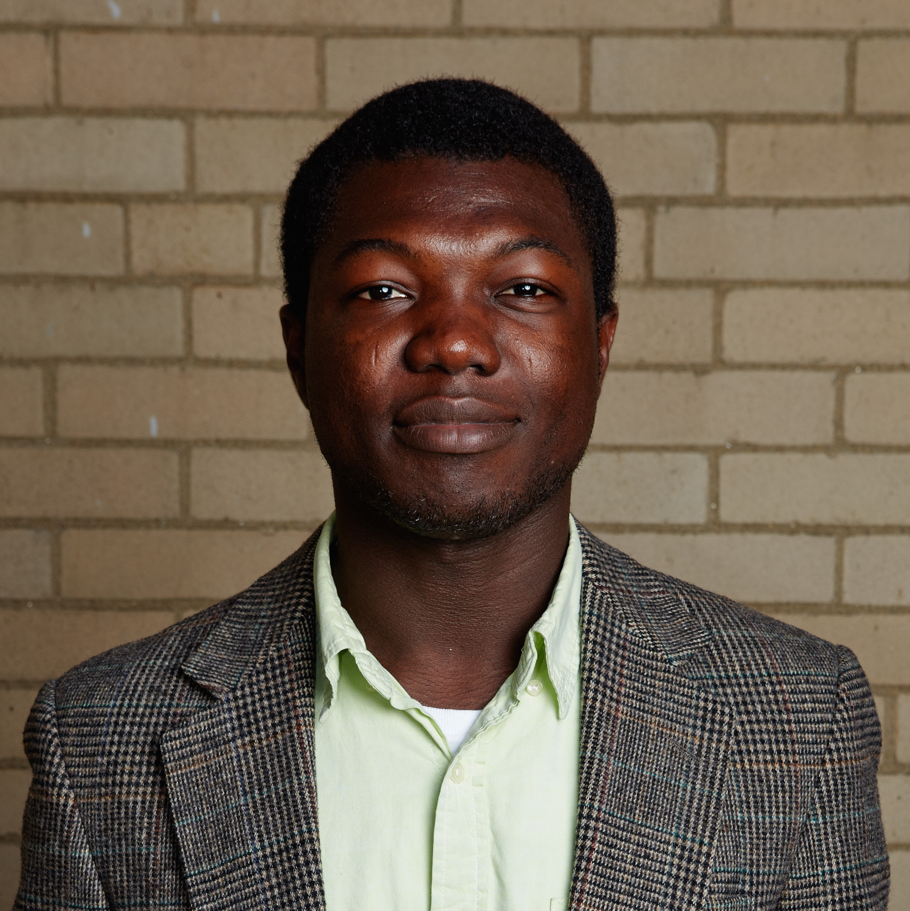

<!-- 

<h1 style="font-weight: bold;">About</h1>

 -->

# **About**
Recently, artificial intelligence has seen the explosion of deep learning models, which are able to reach super-human performance in several tasks, finding application in many domains. These performance improvements, however, come at a cost: DL models are uninterpretable black boxes, where one feeds an input and obtains an output without understanding the motivations behind that prediction or decision. 

To address this problem, two research areas are particularly active: the eXplainable AI (XAI) field and the visual analytics community. The eXplainable XAI field tries to address such problems by proposing algorithmic methods that can explain, at least partially, the behavior of these networks. Their works also try to define the limits of interpretability, the definition of valid metrics, the study of users, and the study of the effectiveness of these solutions. Conversely, visual analytics systems target users helping them to understand and interact with machine learning models providing visualizations and systems that facilitate the exploration, analysis, interaction, and understanding of machine learning models. In the last few years, the usage of methodologies that explain deep learning models has become central in these systems. As a result, the interaction between the XAI and visual analytics communities is becoming more and more important.

The workshop aims at advancing the discourse by collecting novel methods and discussing challenges, issues, and goals around the usage of XAI approaches to debug and improve current deep learning models. To achieve this goal, the workshop aims at bringing researchers and practitioners from both fields, strengthening their collaboration. In particular, we narrow the XAI focus to the specific case in which developers or researchers need to debug their models and diagnose system behaviors. Therefore we start from the assumption that this type of user typically has substantial knowledge about the models themselves but needs to validate, debug, and improve them.

## **Topics**

The topics include <u>but are not limited to</u>:
- Novel XAI methods (*post-hoc, ante-hoc*, etc.);
- Interpretable/Explainable deep learning models;
- Applications and protocols that use current XAI methods to improve and/or debug deep learning models;
- XAI evaluation: how can we assess the quality of explanations and their effectiveness for debugging purposes? 
- Visualization techniques for debugging Deep Learning models;
- Debugging via interpretability: How can explainable artificial intelligence help us in debugging deep learning models?
- Methods to identify and address sources and causes of failure (e.g.training data, regularization, objective functions, etc.);
- Visual analytics systems for understanding and debugging deep learning models;
- Analysis of limitations of current approaches;
- Position papers on the topic of the workshop.

# **Call for Papers**

The call for papers includes three different tracks: *regular*, *mentorship*, and *a glimpse of the future* track.  The first one is the traditional track for presenting novel contributions. The second one is directed to young researchers and aims to pair a mentor and a mentee with the goal of polishing early-submissions. The last one is intended for first-year PhD students and MSc students working on the topic, giving them the possibility to introduce themselves and their research proposal to the research community.

## **Tracks**

### **Regular track:**
Submissions to this track have to be novel contributions covering any topic listed above. We don't accept work that has been already published, that is concurrently submitted to other venues, or that is presented at the main NeurIPS conference, including as part of an invited talk. We solicit submission of full papers, position papers, and papers describing open problems on one of the topics listed above. Papers must be submitted through the <a href="https://openreview.net/group?id=NeurIPS.cc/2021/Workshop/XAI4Debugging">Open Review submission system</a>.

*We encourage the authors to link a repository containing the code to replicate the results inside the corpus of the paper.* While this is not a mandatory requirement, it will be positively taken in account during the reviewing process and the selection of the contributed talks. Submissions must follow the NeurIPS anonymized paper format (see <a href="https://neurips.cc/Conferences/2021/PaperInformation/StyleFiles"> NeurIPS style files</a>), and they are limited to a maximum of 9 pages, excluding references. Shorter papers are welcome. They will undergo double-blind peer review.

**At the end of your paper submission, please indicate whether you would like an extended version of the submission to be considered for publication in a journal special issue**. According to the feedback from authors, we will further decide whether to publish selected high-quality papers in proceedings or a journal special issue. Reviewers will nominate papers among them with exemplary scientific rigor for publication.

Accepted works will be presented as contributed talks or as posters in a poster session or listed on the workshop site as accepted contributions, depending on schedule constraints.
It is mandatory that at least one of the authors will attend the workshop and present its work during the contributed talks and the poster session. 
We are planning to include an additional virtual channel, like Slack, where each accepted paper will have a dedicated section for attendance and authors to discuss. We strongly encourage authors to be available on their section before, during, and shortly after the workshop.

**Important Dates:**

Submission system opens: 11:59 PM CEST, Aug 15, 2021 <a href="https://openreview.net/group?id=NeurIPS.cc/2021/Workshop/XAI4Debugging">LINK</a>

Submission deadline: 11:59 PM CEST, Sep 15, 2021

Notification date:  11:59 PM CEST, Oct 10, 2021

Camera-ready deadline: 11:59 PM CEST, Oct 20, 2021

SlidesLive upload for speaker videos: 11:59 PM CEST, Oct 25, 2021

### **Mentorship track:**
The mentorship track pairs authors with experienced researchers who have committed to providing meaningful feedback to help polish papers for general submission. This program helps authors to get support and fast feedback from the research community, by facilitating a private dialogue between the mentee and mentor. 
The papers of this track have to be non-anonymous, template-free.
Note that the goal of this track is to receive fast feedback about the structure of the paper and to polish it. It is not intended for deep review. None of the papers submitted to this track will be presented or included in the workshop schedule.

**Important Dates:**

Submission deadline: 11:59 PM CEST, Sep 30, 2021 <a href="https://cmt3.research.microsoft.com/XAI4Debugging2021/Track/2/Submission/Create">LINK</a>

### **A glimpse of the future track:**
This special track aims at discovering and highlighting the most promising students in the field. The students will have the possibility to present their research plan to the community, describing the problems that they plan to address and possible research directions. Submissions for this track must include a research plan (max. 2 pages) and a cover letter from the current or future supervisor. The plan should briefly highlight the problem that the researcher will try to attack, the current methodologies and the expected outcome of its research agenda. This track is intended for first-year PhD students or prospective PhD students.

**Important Dates:** 

Submission deadline: 11:59 PM CEST, Sep 20, 2021 <a href="https://cmt3.research.microsoft.com/XAI4Debugging2021/Track/1/Submission/Create">LINK</a>

Notification Date:  11:59 PM CEST, Oct 10, 2021

SlidesLive upload for speaker videos: 11:59 PM CEST, Oct 25, 2021

# **Schedule**

TBD

# **Invited Speakers**

    
    
      
    

    

          

        Speaker: Julius Adebayo 
        Talk: TBD
        

    

    

  
    

    

          

        Speaker: Jacob Andreas 
        Talk: TBD      
        

    

    
   
  
    

        

      

        Andreas Holzinger 
        Talk: TBD      
      

    

    

  
    

        

      

        Himabindu Lakkaraju 
        Talk: TBD      
      

    

    

  
    

        

      

       Shixia Liu 
        Talk: TBD      
      

    

<!-- - <a href="https://www.mit.edu/~jda/">Jacob Andreas</a>
- <a href="https://himalakkaraju.github.io/">Himabindu Lakkaraju</a>
- <a href="https://www.aholzinger.at/">Andreas Holzinger</a>
- <a href="http://shixialiu.com/">Shixia Liu</a> -->

# **Organization**

## **Organizers**

  

    

      <a href="http://robertocapobianco.com/">  
      
      

        <h3>Roberto&nbsp;&nbsp;Capobianco</h3>
        
Sony AI & Sapienza University

      

      </a>
    

  

  

    

      <a href="https://llama.gs/personae/alex/">
      
      

        <h3>Alexander Feldman</h3>
        
PARC

      

      </a>
    

  

  

    

    <a href="http://people.csail.mit.edu/lgilpin/">
      
      

        <h3>Leilani H. Gilpin</h3>
        
Sony AI

      

    </a>
    

  

  

    

      <a href="https://biagiomattialarosa.github.io/">
      
      

        <h3>Biagio La Rosa</h3>
        
Sapienza University of Rome

      

      </a>
    

  

  

    

    <a href="https://wensun.github.io/">
      
      

        <h3>Wen Sun</h3>
        
Cornell University

      

    </a>
    

  

  

    

      <a href="https://www.linkedin.com/in/alice-xiang-3832aa18/">
      
      

        <h3>Alice Xiang</h3>
        
Sony AI

      

      </a>
    

  

## **Advisory Board**
Peter Stone (Sony AI) and Daniele Nardi (Sapienza University of Rome)

## **Program Committee**
- Amirata Ghorbani, Stanford University
- Bilal Alsallakh, Bosh
- Daniele Nardi, Sapienza University of Rome
- Francesca Rossi, IBM 
- Giuseppe Santucci, Sapienza University of Rome 
- Jaesik Choi, KAIST 
- Marco Angelini, Sapienza University of Rome 
- Mark Keane, University College Dublin 
- Przemyslaw Biece, Warsaw University of Technology
- Riccardo Guidotti, University of Pisa
- Rosina Weber, Drexel University  
- Sameer Singh, University of California 
- Tongshuang Wu, University of Washington
- Ute Schmid, University of Bamberg 
- Wojciech Samek, Fraunhofer HHI 

# **Contacts**
If you have any questions feel free to join our <a href="https://join.slack.com/t/xai4debugging-4ua7968/shared_invite/zt-u394toc1-xiAPFBpt7bQPcVxlgqHm3w">slack channel</a> or contact us at any of the following email addresses:
- larosa AT diag.uniroma1.it
- capobianco AT diag.uniroma1.it
- afeldman AT parc.com
- lgilpin AT ucsc.edu

